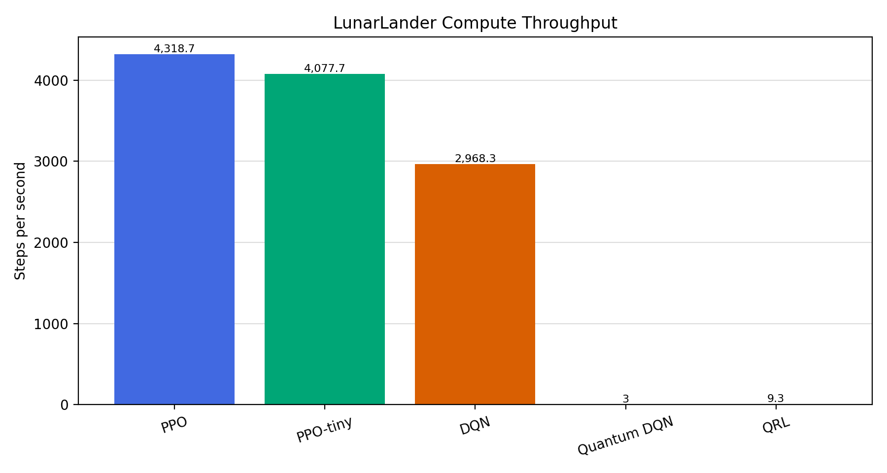
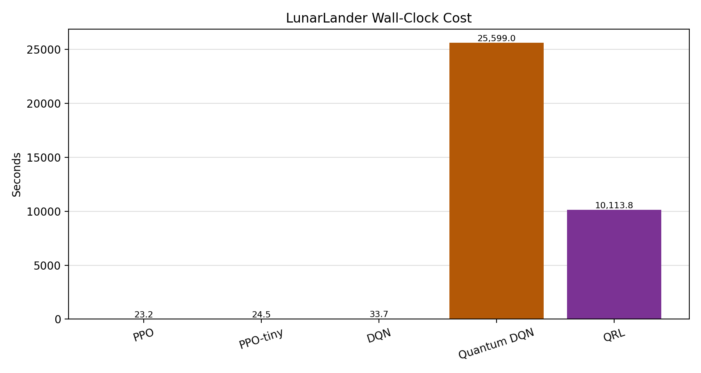
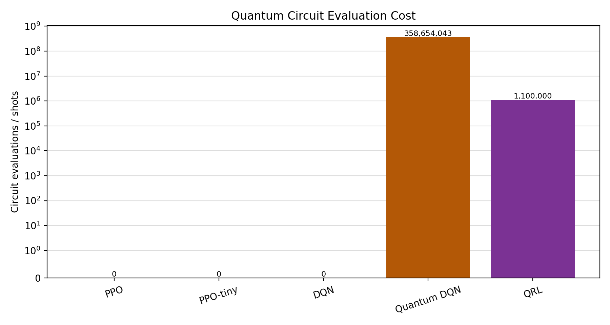

# LunarLander Compute-Cost Comparison

| Agent | Category | Steps | Wall-clock (s) | QPU exec. (s) | SPS | Circuit evals | Final reward | Success rate | Status |
| --- | --- | --- | --- | --- | --- | --- | --- | --- | --- |
| PPO | Matched 100k classical | 100,000 | 23.2 |  | 4,318.7 | 0 | -233.738 | 0 | complete matched-budget result |
| PPO-tiny | Matched 100k classical | 100,000 | 24.5 |  | 4,077.7 | 0 | -1,187.776 | 0 | complete matched-budget result |
| DQN | Matched 100k classical | 100,000 | 33.7 |  | 2,968.3 | 0 | -156.345 | 0 | complete matched-budget result |
| Quantum DQN | Matched 100k quantum | 100,000 | 25,599.0 |  | 3 | 358,654,043 | -217.484 | 0 | complete matched-budget result |
| QRL | Matched 100k quantum | 100,000 | 10,113.8 |  | 9.3 | 1,100,000 | -815.517 | 0 | complete matched-budget result |

## Plots

**Caption.** Steps per second for completed matched-budget LunarLander runs.

**Caption.** Wall-clock seconds for each completed matched-budget LunarLander run category.

**Caption.** Circuit evaluation cost. Classical models have zero circuit evaluations; quantum rows report simulated circuit evaluations during matched-budget training.

## Report-Ready Interpretation

The compute-cost results use the completed matched 100,000-step LunarLander cohort. This keeps environment interactions, seed protocol, and evaluation cadence aligned across PPO, PPO-tiny, DQN, Quantum DQN, and QRL. The quantum agents complete the same nominal training budget, but their wall-clock cost is much higher because simulated circuit evaluation dominates throughput.

## IBM QPU Hardware Details

| Hardware detail | Value |
| --- | --- |
| Backend | ibm_kingston |
| Processor type | Heron r2 |
| Region | Washington DC us-east |
| Qubits | 156 |
| Couplers | 176 |
| Median 2Q error | 2.01E-3 |
| Layered 2Q error | 3.42E-3 |
| CLOPS | 340K |
| Median readout error | 8.91E-3 |
| Median T1 | 256.51 us |
| Median T2 | 132.57 us |

The IBM hardware run separates end-to-end script/job wall-clock time from actual QPU execution time. The output file reports about 1,618 seconds for the job/script path, while the IBM dashboard showed about 2 seconds of QPU execution on `ibm_kingston`. This means the QPU can execute the small inference circuit quickly once the job reaches hardware, but practical usability is still shaped by queue time, runtime overhead, shot noise, hardware noise, limited free QPU access, and the fact that training was still performed in simulation. The 2-second QPU runtime should not be treated as full training time or as evidence of quantum advantage.

## Notes

- Rows come from `lunarlander_aggregate_results.csv` with `included_in_plots == yes`.
- The IBM inference artifact remains separate because it is inference-only, not a matched training run.
