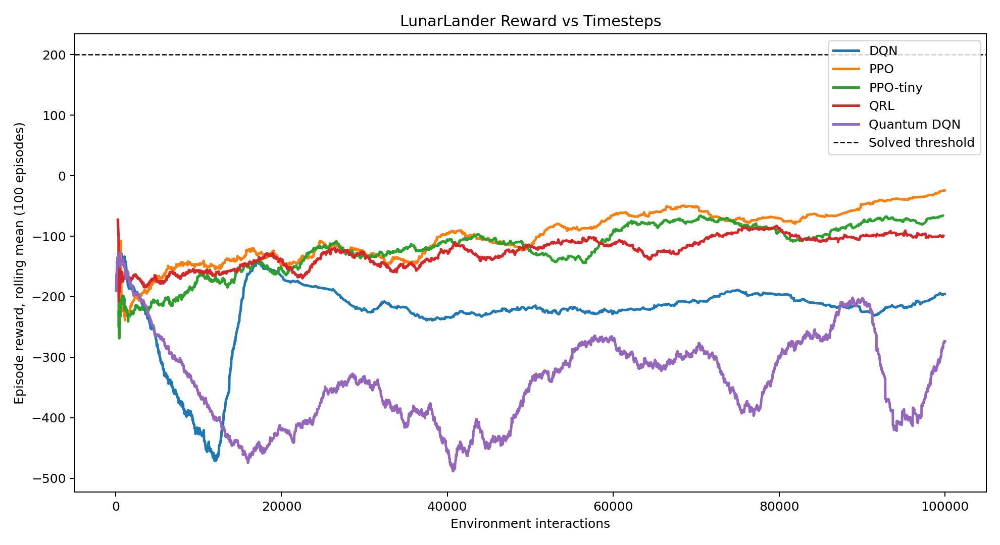
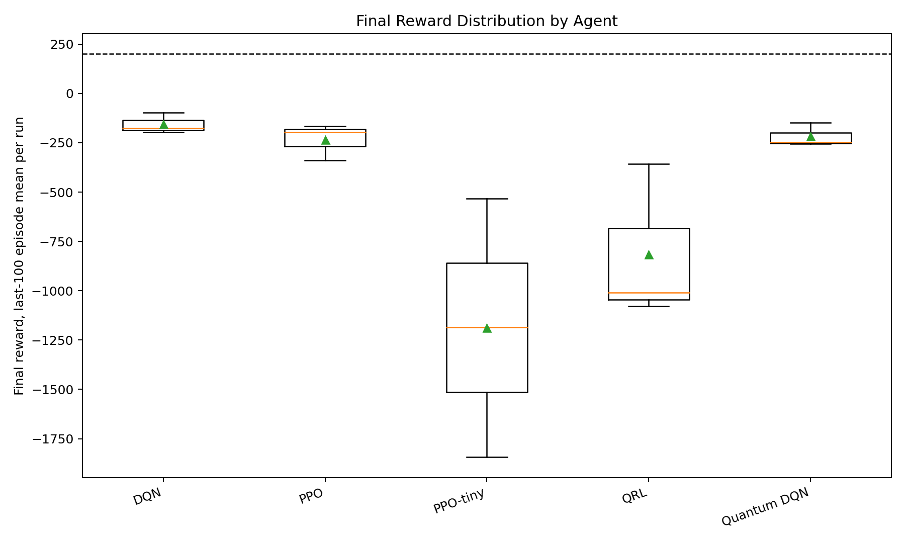
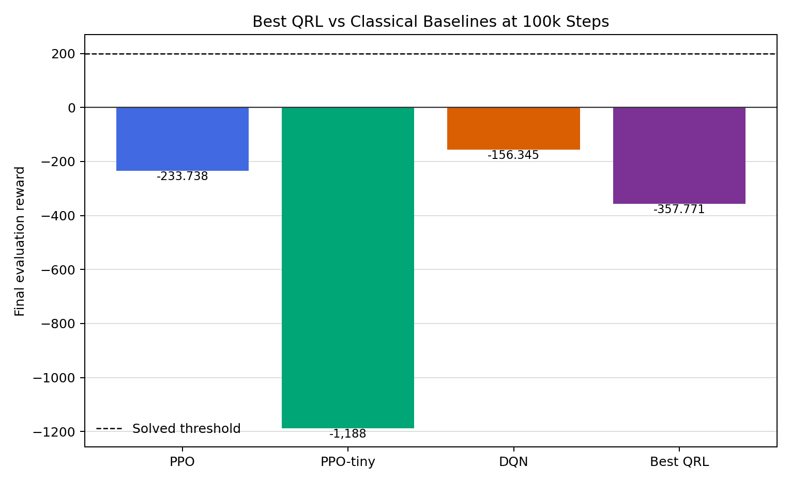
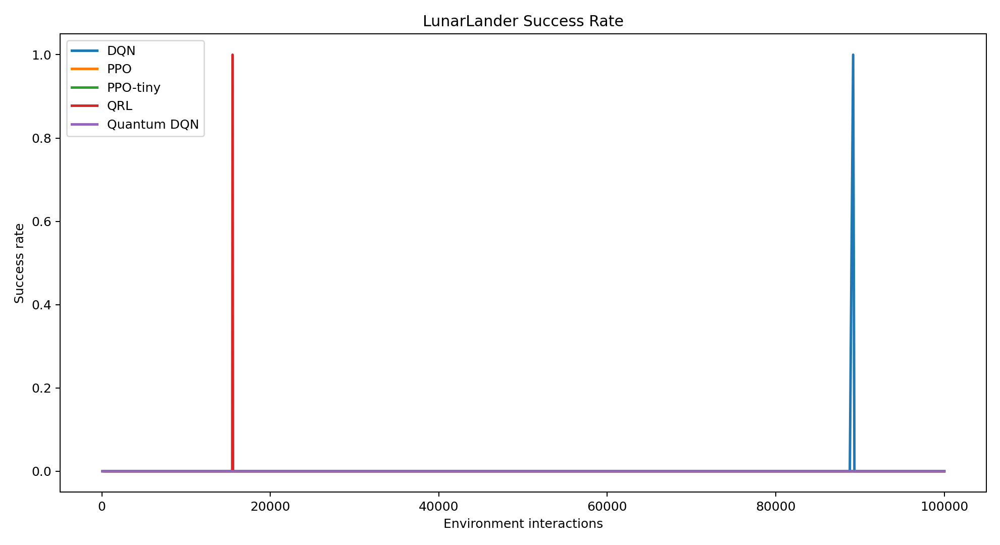
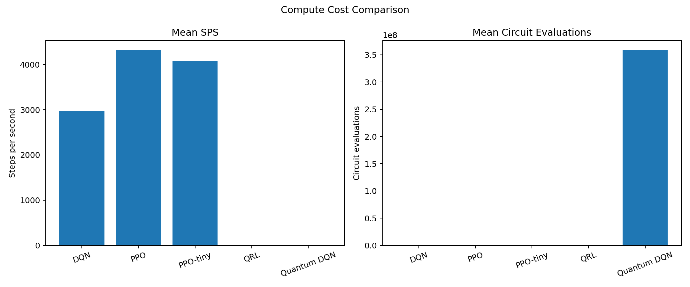

# Standardized LunarLander-v3 Comparison Results

This section reports the standardized LunarLander-v3 comparison after enforcing a common environment, preprocessing path, action space, training budget, seed protocol, evaluation cadence, and logging schema. Main conclusions below use **only completed runs** from the matched 100,000-step cohort with seeds 0, 1, 2. Older full-training or partial exploratory runs are retained in the aggregate CSV for transparency, but are excluded from the main plots and summary statistics.

## Matched-Budget Results

The matched-budget comparison should be treated as the primary result because every plotted agent uses the same 100,000 environment-interaction budget and the same three seeds.

*Figure: Reward vs environment interactions for the completed matched-budget runs only. Curves show rolling mean episode reward.*

*Figure: Final evaluation reward distribution by agent for completed matched-budget runs.*

*Figure: Final reward bar chart comparing the best QRL run against the mean PPO, PPO-tiny, and DQN baselines from the same 100,000-step cohort.*

*Figure: Success rate over training for completed matched-budget runs. Success is defined by the configured LunarLander threshold of episode reward >= 200.*

## Compute Diagnostics

*Figure: Compute cost comparison for completed matched-budget runs. Quantum circuit evaluation counts are reported separately because simulator overhead is not captured by environment interactions alone.*

The matched-budget results support the practical conclusion that simulated quantum RL has major overhead in this setup. The quantum agents complete the same environment-interaction budget, but at much lower throughput and with substantial circuit-evaluation cost.

## Run Status Table

| Group | Agent | Final reward | Success rate | Timesteps completed | Wall-clock time | SPS | Circuit evaluations | Status |
| --- | --- | ---: | ---: | ---: | ---: | ---: | ---: | --- |
| Complete | DQN | -156.345 | 0.000 | 100,000 | 0.01 hours | 2,968 |  | Complete matched-budget runs |
| Complete | PPO | -233.738 | 0.000 | 100,000 | 0.01 hours | 4,319 |  | Complete matched-budget runs |
| Complete | PPO-tiny | -1,188 | 0.000 | 100,000 | 0.01 hours | 4,078 |  | Complete matched-budget runs |
| Complete | QRL | -815.517 | 0.000 | 100,000 | 2.81 hours | 9.333 | 1,100,000 | Complete matched-budget runs |
| Complete | Quantum DQN | -217.484 | 0.000 | 100,000 | 7.11 hours | 3.000 | 358,654,043 | Complete matched-budget runs |
| Incomplete quantum | Quantum DQN | -118.159 | 0.000 | 447,700 | 1.49 days | 3.000 | 1,744,141,000 | Incomplete; excluded from main final-performance plots |
| Incomplete quantum | Quantum DQN | -195.898 | 0.000 | 21,587 | 0.02 hours |  | 46,215,540 | Incomplete; excluded from main final-performance plots |

**Interpretation rule:** use the complete-run rows for final-performance conclusions. Use the incomplete quantum rows only to discuss computational feasibility and matched-budget diagnostics.
