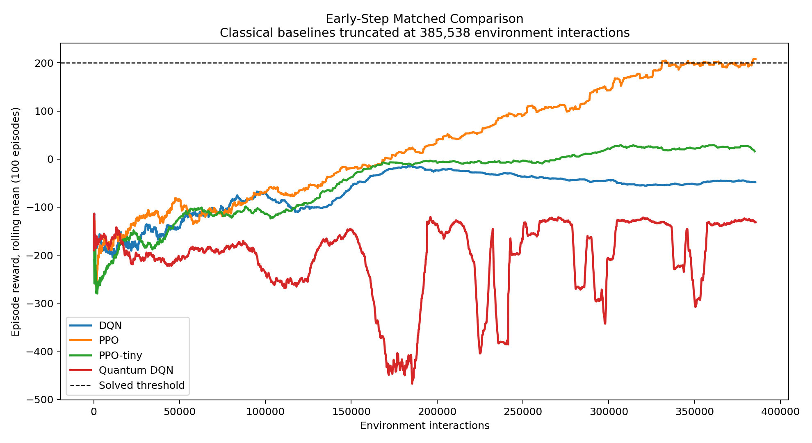
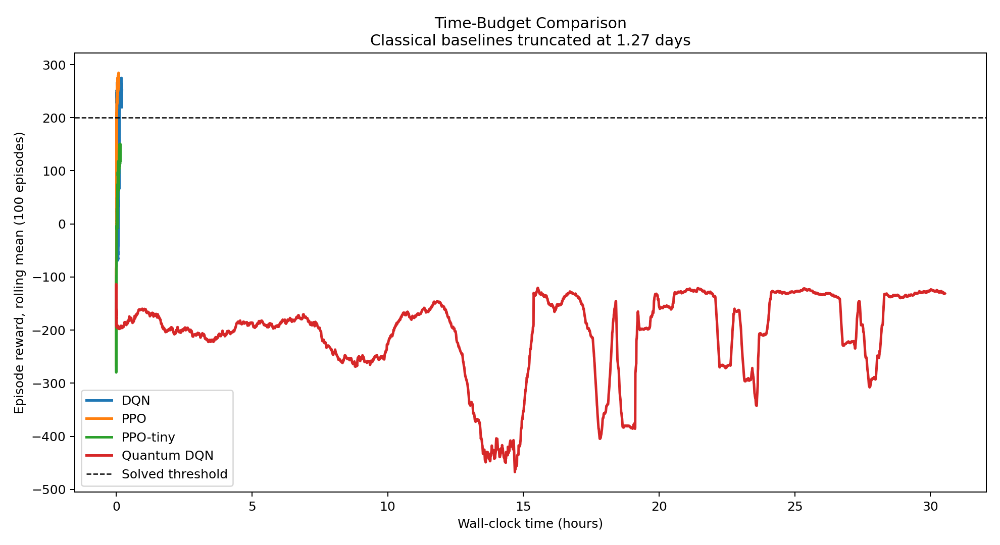

# Standardized LunarLander-v3 Comparison Results

This section reports the standardized LunarLander-v3 comparison after enforcing a common environment, preprocessing path, action space, training budget, seed protocol, evaluation cadence, and logging schema. Final-performance conclusions below use **only completed runs** that reached the full 2,000,000 environment interactions and produced the required evaluation/checkpoint outputs at every 100,000-step interval. Incomplete runs are retained in the aggregate CSV for transparency, but are excluded from the main final-performance plots and summary statistics.

## Completed-Run Results

The completed-run comparison should be treated as the primary result. The classical agents that completed the standardized protocol show strong final evaluation performance for PPO and DQN, while PPO-tiny remains substantially weaker. These results are shown in:

*Figure: Full-training reward vs environment interactions for complete standardized runs only. Curves show rolling mean episode reward; incomplete quantum runs are excluded from this main plot.*

*Figure: Final reward distribution by agent for complete standardized runs only. This is the appropriate plot for full-training final-performance conclusions.*

*Figure: Success rate over training for complete standardized runs only. Success is defined by the configured LunarLander threshold of episode reward >= 200.*

## Supplemental Matched-Budget Diagnostics

The quantum DQN runs did not complete the full 2,000,000-interaction protocol. The longest incomplete quantum DQN run reached approximately **385,538** environment interactions after about **1.27 days** of wall-clock time. Because these runs are incomplete, they are **not** used for main final-performance claims.

To make the partial quantum results interpretable without overstating them, two supplemental comparisons are provided:

*Figure: Early-step matched comparison. Classical baselines are truncated to the same maximum environment-step budget reached by the incomplete quantum runs. This plot is a diagnostic of early-training behavior, not a final-performance result.*

*Figure: Time-budget comparison. Classical baselines are truncated to the same wall-clock budget consumed by the incomplete quantum runs. This plot is a diagnostic of practical compute efficiency, not a final-performance result.*

*Figure: Compute cost comparison for complete runs where available. Quantum circuit evaluation counts are reported separately because simulator overhead is not captured by environment interactions alone.*

These supplemental plots support the practical conclusion that simulated quantum RL has major overhead in this setup. In particular, quantum DQN is computationally infeasible under the current project time budget: it fails to reach the full standardized training horizon in a reasonable time, while classical baselines complete the same nominal environment-interaction budget quickly enough to support full-seed evaluation.

## Run Status Table

| Group | Agent | Final reward | Success rate | Timesteps completed | Wall-clock time | SPS | Circuit evaluations | Status |
| --- | --- | ---: | ---: | ---: | ---: | ---: | ---: | --- |
| Complete | DQN | 263.940 | 1.000 | 2,000,000 | 0.12 hours | 15,427 |  | Complete full-training runs |
| Complete | PPO | 282.657 | 1.000 | 2,000,000 | 0.10 hours | 6,580 |  | Complete full-training run |
| Complete | PPO-tiny | 170.232 | 0.500 | 2,000,000 | 0.15 hours | 3,801 |  | Complete full-training run |
| Incomplete quantum | Quantum DQN | -118.159 | 0.000 | 385,538 | 1.27 days | 308.000 | 1,496,274,637 | Incomplete; excluded from main final-performance plots |
| Incomplete quantum | Quantum DQN | -195.898 | 0.000 | 21,587 | 0.02 hours | 343.000 | 46,215,540 | Incomplete; excluded from main final-performance plots |

**Interpretation rule:** use the complete-run rows for final-performance conclusions. Use the incomplete quantum rows only to discuss computational feasibility and matched-budget diagnostics.
